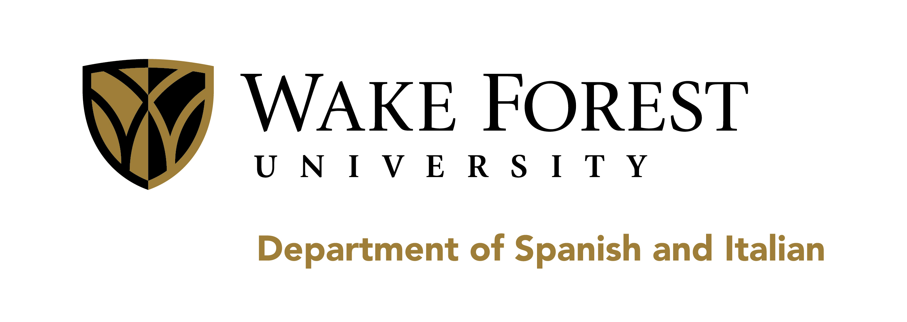

```{r setup, include=FALSE}
library(tidyverse)
```


<h3>October 15th-17th  
Wake Forest University  
Winston-Salem, NC</h3>

## News {#news}

<!-- work in progress...-->
<style>
img.news {
  width:50%;    
  float:left;
}

iframe.news {
  width:50%;    
  float:right;
}

.clear {
  clear:both;
}
</style>


<a class="twitter-timeline news" data-width="50%" data-height="260" data-theme="light" data-link-color="#E81C4F" href="https://twitter.com/hls2020?ref_src=twsrc%5Etfw">Tweets by hls2020</a> <script async src="https://platform.twitter.com/widgets.js"></script>

<div class="clear"></div>

<a href="https://twitter.com/intent/tweet?button_hashtag=hls2020&ref_src=twsrc%5Etfw" class="twitter-hashtag-button" data-url="http://hls2020.wfu.edu" data-related="hls2020" data-show-count="false">Tweet #hls2020</a><script async src="https://platform.twitter.com/widgets.js" charset="utf-8"></script>

## Keynote speakers {#speakers}

<ul class="speakers-list">

  <li class="speakers-item">
    <span class="speaker-photo">
      <a href="https://hip.uic.edu/profiles/potowski-kim/" target="_blank">
        
      </a>
    </span>
    <h3 class="speakers-name">Dr. Kim Potowski</h3>
    <h3 class="speakers-affiliation">University of Illinois at Urbana-Champaign</h3>
    <h3 class="speech-title"> </h3>
  </li>
  
  <li class="speakers-item">
    <span class="speaker-photo">
      <a href="http://www.concepcioncompany.com" target="_blank">
        
      </a>
    </span>
    <h3 class="speakers-name">Dr. Concepción Company Company</h3>
    <h3 class="speakers-affiliation">Universidad Nacional Autónoma de México</h3>
    <h3 class="speech-title"> </h3>
  </li>
  
  <li class="speakers-item">
    <span class="speaker-photo">
      <a href="https://www.colorado.edu/spanish/esther-brown" target="_blank">
        
      </a>
    </span>
    <h3 class="speakers-name">Dr. Esther Brown</h3>
    <h3 class="speakers-affiliation">University of Colorado Boulder</h3>
    <h3 class="speech-title"> </h3>
  </li>
  
</ul>


## Program {#program .tabset .tabset-fade .tabset-pills}


### October 15

TBA

```{r timevis-one, echo=FALSE, include=FALSE}
library(timevis)

data <- 
  tibble::tribble(
  ~id, ~content, ~start, ~end, ~group, ~type, ~title,
  1, "Check in", "2020-10-15 12:00:00", "2020-10-15 13:30:00", 1, "", "Check in",
  2, "Registration", "2020-10-15 12:00:00", "2020-10-15 16:30:00", 1, "", "",
  3, "Talks", "2020-10-15 12:00:00", "2020-10-15 13:00:00", 3, "", "",
  4, "Talks", "2020-10-15 14:00:00", "2020-10-15 17:00:00", 3, "", "",
  5, "Poster", "2020-10-15 17:00:00", "2020-10-15 18:15:00", 3, "", "",
  6, "Kim Potowski", "2020-10-15 18:30:00", "2020-10-15 19:15:00", 4, "", "",
  7, "Lunch", "2020-10-15 13:00:00", "2020-10-15 14:30:00", 2, "", ""
)

groups <- 
  tibble::tribble(
    ~id, ~content,
    1, "Admin",
    2, "Breaks",
    3, "Sessions",
    4, "Plenaries"
  )

timevis(data, groups, options = list(selectable = FALSE))
```

```{r program-one, echo=FALSE, include=FALSE}
library(DT)

program <- tibble::tribble(
  ~date, ~time, ~author, ~title, ~session, ~chair, ~location,
  "2020-10-15", "13:00:00", "L. Hernández", "El pronombre uno como estrategia discursiva multifuncional: Entrevistas con mujeres guatemaltecas y mexicanas deportadas", "Discourse Analysis", "Alfredo Urzúa", "Acacia Room 102A"
)

datatable(program)
```


### October 16

TBA

### October 17

TBA

## Logistics {#logistics}

### Getting to Winston-Salem

Winston-Salem is served primarily by the __Piedmont Triad International Airport (GSO)__ in Greensboro, NC. Taxis and rental cars are available, and express shuttle service is operated from the PTI Airport to Winston-Salem. For more information you can visit [visitwinstonsalem.com](https://visitwinstonsalem.com).

Other regional airports include:

__Charlotte Douglas International Airport (CLT)__ is about 90 minutes away. Information on transportation to Winston-Salem from CLT can be found at the airport website or you may want to check out a company called [Official Shuttle](http://www.booktheride.com) with transfers to Winston-Salem.

__Raleigh/Durham International Airport (RDU)__ is about a 2-hour drive away. Information on transportation to Winston-Salem from RDU can be found at the airport website.

NOTE: _Smith Reynolds Airport (INT)_ in Winston-Salem is available primarily to charter and private aircraft.

### Conference location

The conference will be held downtown Winston-Salem, NC at the new [Wake Downtown](https://wakedowntown.wfu.edu) campus. Please use the map below to prepare local transportion, accommodation, restaurant, and entertainment plans. 

<iframe src="https://www.google.com/maps/embed?pb=!1m18!1m12!1m3!1d3223.7495655685784!2d-80.24215808490376!3d36.09959238009886!2m3!1f0!2f0!3f0!3m2!1i1024!2i768!4f13.1!3m3!1m2!1s0x8853ae5daadcf6b3%3A0x2309a7ebbb1e625f!2sWake+Downtown!5e0!3m2!1sen!2sus!4v1564887715132!5m2!1sen!2sus" width="100%" height="450" frameborder="0" style="border:0" allowfullscreen></iframe>

### 360° tours

Exterior of Wake Downtown located in [Winston-Salem’s Innovation Quarter](https://www.innovationquarter.com).

```{r wake-downtown-outside-view, echo=FALSE}
knitr::include_url(url = "https://theta360.com/s/nzuanEB1RNdKdHjea8bA2kmjg?view=embed&width=970px&height=375px")
```

Wake Downtown Auditorium

```{r wake-downtown-auditorium-view, echo=FALSE}
knitr::include_url(url = "https://theta360.com/s/ksBeBbuD3lmJiNGik2hcAi1vk?view=embed&width=970px&height=375px")
```

## Contact {#contact}

__Conference email__  

[HLSWFU2020@gmail.com](mailto:://HLSWFU2020@gmail.com)

__Conference address__

Hispanic Linguistics Symposium 2020  
323 Greene Hall  
Wake Forest University  
Winston-Salem, NC 27109 

__Organizing committee__

- Tiffany Judy [judyte@wfu.edu](mailto://judyte@wfu.edu)
- Luis González [gonzall@wfu.edu](mailto://gonzall@wfu.edu)
- Irma Alarcón [alarcoi@wfu.edu](mailto://alarcoi@wfu.edu)
- Diego Burgos [burgosda@wfu.edu](mailto://burgosda@wfu.edu)
- Jerid Francom [francojc@wfu.edu](mailto://francojc@wfu.edu)
- Claudia Valdez [valdezc@wfu.edu](mailto://valdezc@wfu.edu)
- Cesar Gutiérrez [gutiermc@wfu.edu](mailto://gutiermc@wfu.edu)
- Lauren Miller [millerle@wfu.edu](mailto://millerle@wfu.edu)
- Sara Fernández-Cuenca [fernans@wfu.edu](mailto://fernans@wfu.edu)

## Sponsors {#sponsors}

<!-- work in progress...

Sponsors: 

- NEH (logo)
- WFU Humanities Institute (logo)
- WFU Spanish and Italian Department (logo)
- WFU Linguistics Minor (get)
- WFU Latin American & Latino Studies (get)
- WFU Provost's Office (get)

-->
<style>
.img-float {
  float:left;
  padding: 1%;
  margin-left: auto;
  margin-right: auto;
}
</style>

The Hispanic Linguistics Symposium 2020 has been sponsored by the Wake Forest University Humanities Institute with support made possible by a major grant from the National Endowment for the Humanities.

<div class="img-float">
  
  
</div>

<div class="clear"></div>

_Any views, findings, conclusions, or recommendations expressed in this conference, do not necessarily represent those of the National Endowment for the Humanities._

This event has also received generous support from the following sources: 

<!-- 
<div class="img-float">
  
</div>

<div class="clear"></div>
-->

- WFU Spanish and Italian Department
- WFU Linguistics Minor
- WFU Latin American & Latino Studies
- WFU Provost's Office